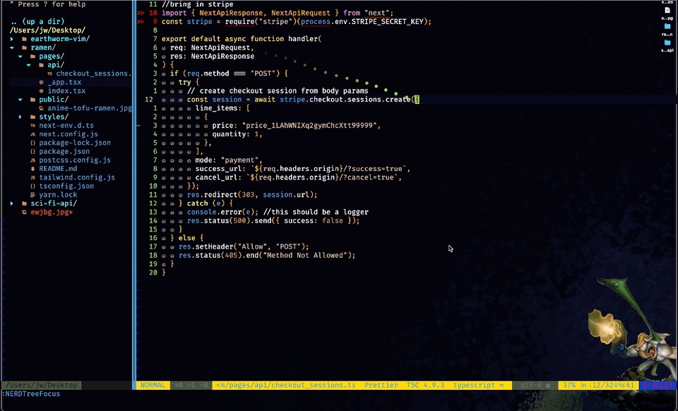
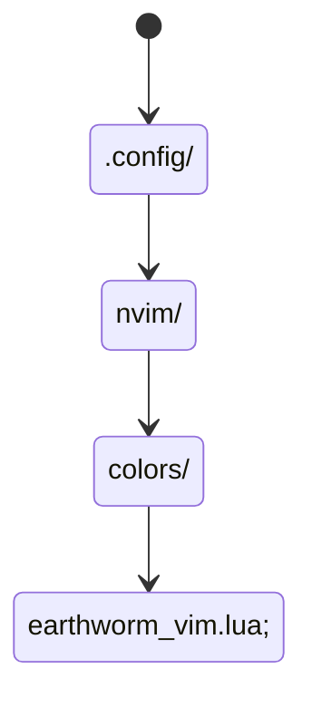

 

 <h1>EARTHWORM VIM</h1>
 
 

 

## What is this?

A Neovim theme based on EARTHWORM JIM the video game.

## Color Palette

## Notes
It should mostly work with common plugins treesitter, nerdtree, Conquer of Completion.
I included the bg art for aesthetics.

## Possible Future Plans 
Might add an official Airline | Powerline theme.
Light Mode for you sickos.

## Installation
Just add .config/nvim/colors/ directory to your config, place earthworm-vim.lua file in there.

After including earthworm-vim.lua in your config setup, you can add the following to you init file.
`colo earthworm-vim` 
Alternatively you can just call it from your workspace.
`:colorscheme earthworm-vim`
